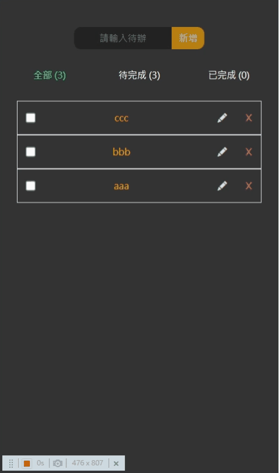

# 可存資料在localstorage的todolist    
【DEMO : https://chienyuyu.github.io/vueTodolist/ 】
*****************
 

## 使用技術 / 套件
| 技術              | 簡述                       |
| ---------------- | -------------------------- |
| Vue Cli 3        | 以 Vue.js 開發   |
| VueComponents    | 元件拆分 | 
| Vuex             | 跨元件資料傳遞，作為狀態管理工具。|
| Bootstrap 5      | 格線系統使用  |
****************
 

***

***
